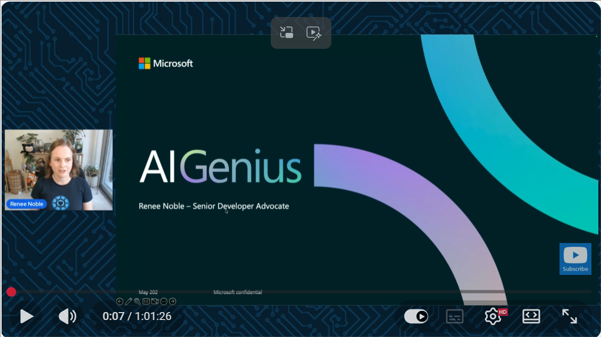
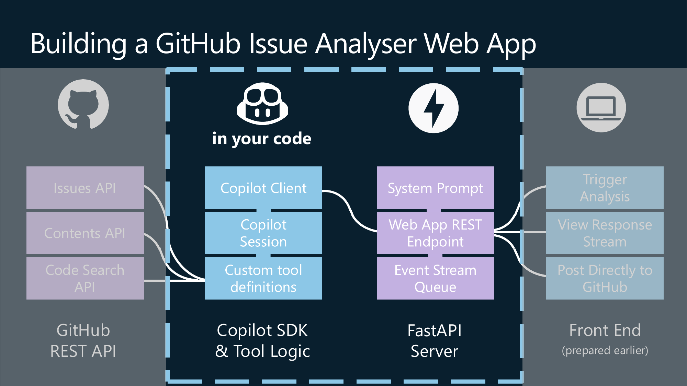
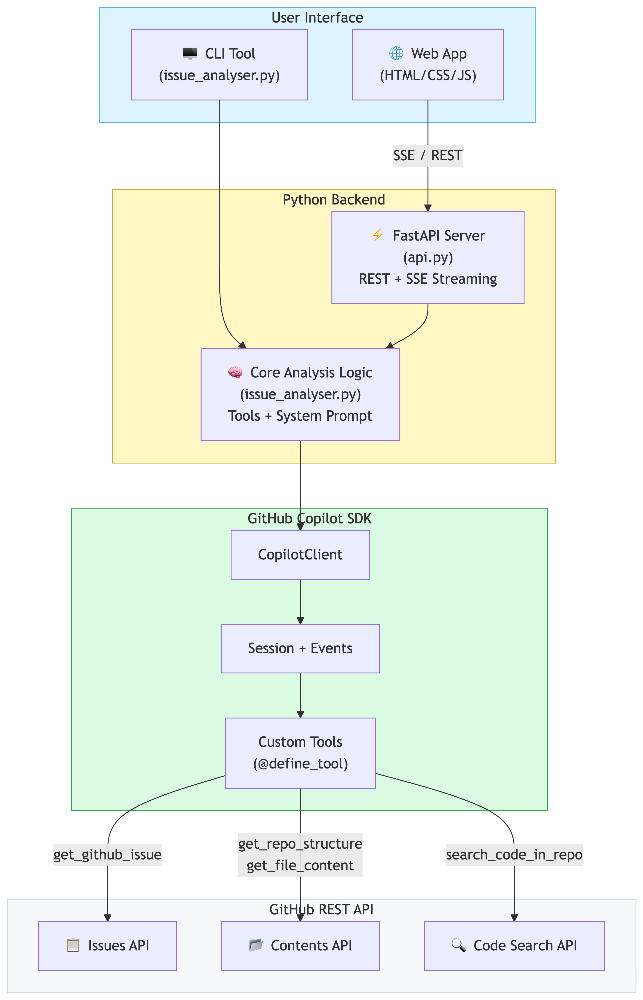
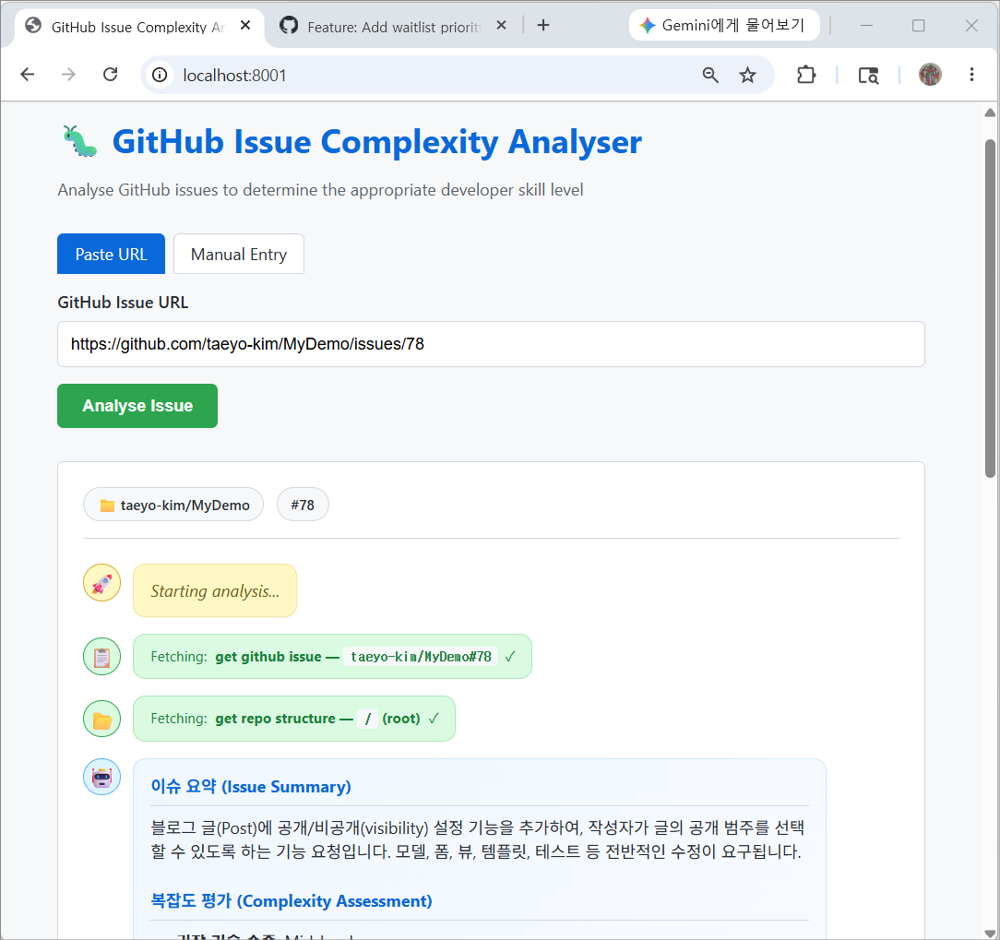

# 🤖 GitHub Copilot SDK 미니 워크샵 

이 실습은 원본 리포인 https://github.com/reneenoble/copilot-sdk-github-issue-analyser의 **GitHub Issue 분석기 프로젝트**를 참고하여 작성된 한글 실습 자료입니다. 자세한 내용과 설명은 다음의 유튜브 영상에서 확인할 수 있습니다.

https://www.youtube.com/watch?v=7VrPUZgMrjY

<a href="https://www.youtube.com/watch?v=7VrPUZgMrjY"></a> 

실습은 GitHub Copilot SDK를 활용하여 GitHub 이슈를 분석하여, 해당 이슈의 구현 난이도와 적합한 개발자 숙련도를 판단하는 에이전트를 만드는 것입니다. 이 실습은 Copilot SDK의 도구 호출, 이벤트 기반 응답 처리, GitHub API 연동, 웹 UI 스트리밍 등 다양한 기능을 포함하고 있습니다.

## 소개

이 실습은 GitHub Copilot SDK를 이용해 에이전트형 이슈 분석 도구를 만드는 예제를 제공합니다. 에이전트는 단순히 이슈 본문만 읽는 것이 아니라, 저장소 구조를 탐색하고 관련 코드를 검색하고 실제 파일을 읽은 뒤, 그 근거를 바탕으로 이슈 난이도를 판단합니다.

이 실습의 목표는 다음 두 가지입니다.

- Copilot SDK로 어떤 식의 애플리케이션을 만들 수 있는지 보여주기
- 도구 호출, 스트리밍, 웹 UI, GitHub 연동까지 포함한 실전형 흐름을 이해하기


## Copilot SDK란?

Copilot SDK는 GitHub Copilot의 기능을 내 애플리케이션에서 사용할 수 있도록 해주는 라이브러리입니다. 자세한 내용은 공식 문서를 참고하세요.

[https://github.com/github/copilot-sdk/blob/main/README.md](https://github.com/github/copilot-sdk/blob/main/README.md)

GitHub Copilot을 편집기(IDE) 안에서 사용하는 것과 Copilot SDK를 사용하는 것은 다릅니다.

| 편집기의 Copilot | Copilot SDK |
|---|---|
| VS Code 같은 IDE에 내장 | Python, JavaScript, C#용 라이브러리 |
| 코드를 작성할 때 직접 도움 제공 | 내 애플리케이션 코드가 Copilot을 호출 |
| 결과를 사람이 바로 확인 | 결과를 받은 뒤 내 코드가 후속 동작 수행 |
| 개발자용 도구 | 애플리케이션용 빌딩 블록 |

즉, Copilot SDK는 Copilot을 내 앱 안으로 가져오는 방식입니다.

이 실습에서는 다음 요소를 사용합니다.

- CopilotClient
- Session
- define_tool 기반 커스텀 도구
- 이벤트 기반 응답 처리
- FastAPI와 SSE 스트리밍

## 핵심 동작 흐름

실습 애플리케이션은 아래 순서로 동작합니다.

1. 사용자가 GitHub 이슈 URL 또는 이슈와 관련된 정보를 입력합니다.
2. 애플리케이션이 Copilot 세션을 생성합니다.
3. 에이전트가 필요한 TOOL을 스스로 선택해 호출합니다.
4. TOOL은 GitHub API에서 이슈, 저장소 구조, 코드 검색 결과, 파일 내용을 가져옵니다.
5. 에이전트가 근거를 바탕으로 난이도와 권장 숙련도를 정리합니다.
6. 필요하면 사람이 검토한 뒤 GitHub 이슈에 해당 내용을 코멘트로 남깁니다.

## 아키텍처



### 상세 아키텍처 이미지

아래 이미지는 이 실습의 주요 구성요소를 한눈에 보여주는 정적 아키텍처 다이어그램입니다.



## 실제 화면 예시



## 학습 포인트

이 실습을 통해 특히 익힐 수 있는 내용은 다음과 같습니다.

- Copilot SDK의 기본 연결 방식
- 이벤트 기반 응답 처리와 스트리밍 UX
- 시스템 프롬프트로 에이전트 행동 설계하기
- GitHub API와 연계한 도구 호출 패턴
- 사람 검토를 포함한 안전한 write-back 흐름

## 실습

### 저장소 clone

먼저 실습에 사용할 저장소를 로컬로 clone 합니다.

```bash
git clone https://github.com/taeyo-kim/copilot-sdk-github-issue-analyser
cd copilot-sdk-github-issue-analyser
```

그 다음, Visual Studio Code에서 [Prerequisite.ipynb](Prerequisite.ipynb)부터 시작해 보세요. 단계별로 필요한 설정과 실행 방법이 안내되어 있습니다. 사전준비가 끝나면, [lab.ipynb](lab.ipynb)에서 실제 애플리케이션 구현 과정을 따라가 볼 수 있습니다.

1. [Prerequisite.ipynb](Prerequisite.ipynb)에서 환경 설정과 의존성 설치를 완료합니다.
2. [lab.ipynb](lab.ipynb)에서 단계별로 코드를 작성하며 애플리케이션을 완성합니다.

## 문제 해결 팁

- `GITHUB_TOKEN not found`: `.env` 파일 또는 환경 변수 설정을 확인합니다.
- `Rate limit exceeded`: 토큰이 제대로 읽히지 않았을 가능성이 큽니다.
- `Model not available`: Copilot 사용 권한과 CLI 설정을 확인합니다.
- 웹 UI 연결 문제: `localhost` 대신 `127.0.0.1`로 접속해 봅니다.

## 책임 있는 사용

이 실습의 분석 결과는 참고 자료이지, 최종 의사결정을 대체하지 않습니다.
특히 숙련도 판단은 코드베이스 맥락에 따라 달라질 수 있으므로 사람이 최종 검토해야 합니다.